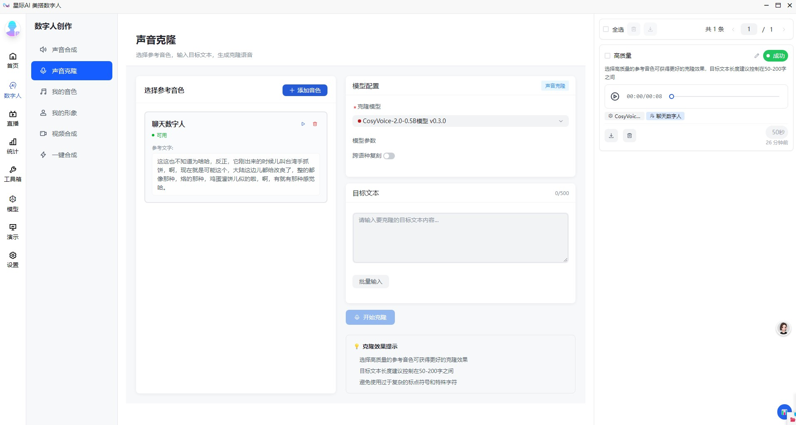
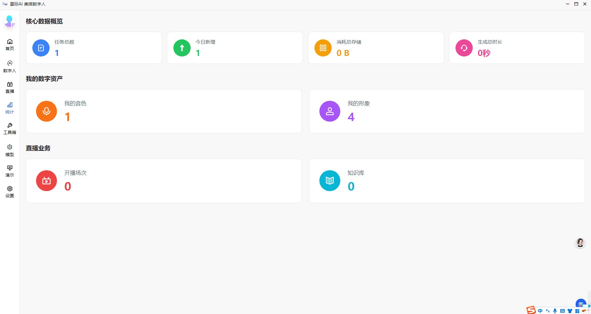
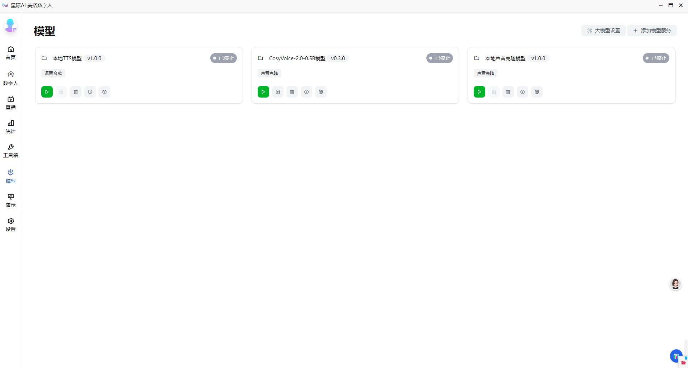
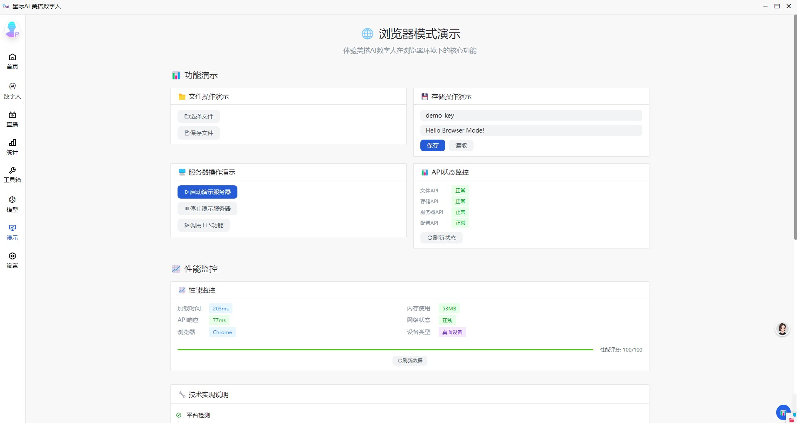

# 星际AI - 美搭数字人平台

[简体中文](./README.md) | [English](./README_en.md)

[](./LICENSE)
[](https://www.electronjs.org/)
[](https://vuejs.org/)
[](https://www.typescriptlang.org/)

**美搭AI数字人(xjaigc)** 是一款功能强大的AI数字人SaaS系统，支持私有化部署。它集成了业界领先的AI模型，为个人和企业用户提供一站式数字人解决方案。

我们的愿景是让每个人都能轻松拥有和使用自己的数字分身。

## ✨ 核心功能

- **文本转语音 (TTS)**: 输入文本，选择不同音色，快速生成高质量语音。
- **声音克隆 (Voice Clone)**: 仅需5-30秒参考音频，即可克隆任何人的声音，用于新文本的语音合成。
- **视频对口型 (Video Lip-Sync)**: 上传人物视频和音频，生成精准对口型的数字人视频。
- **模型热插拔**: 支持在应用运行时动态加载和卸载AI模型，无需重启。
- **自定义模型接入**: 支持简单接入，开发者仅需一个配置文件和一个Python脚本即可快速集成自定义AI模型。

## 🏗️ 技术架构

本应用采用前后端分离的现代化桌面应用架构，确保了高可维护性和扩展性。

- **桌面端框架**: Electron
- **前端技术栈**: Vue3 + TypeScript + Vite
- **UI 框架**: Arco Design Vue
- **状态管理**: Pinia
- **AI模型服务**: 通过子进程管理，支持内置TS服务和自定义Python服务
- **性能优化**: 虚拟滚动、数据缓存、组件懒加载、内存管理
- **进程管理**: 统一的进程生命周期管理、IPC通信优化、资源自动清理

## 🚀 快速开始

1.  **克隆项目**
    ```bash
    git clone https://github.com/ryonWang/xjaigc.git
    cd xjaigc
    ```

2.  **安装依赖**
    ```bash
    npm install
    ```

3.  **启动应用**
    ```bash
    npm run dev
    ```

## 🔧 性能优化特性

应用经过深度性能优化，确保在处理大量数据和高频操作时保持流畅：

### 阶段一：资源管理优化
- **音频/视频播放器优化**: 完整的资源清理机制，防止内存泄漏
- **事件监听器管理**: 防重复注册、安全移除、全面清理
- **组件生命周期**: 自动资源清理钩子，确保组件销毁时释放所有资源
- **内存监控**: 实时内存使用监控，自动垃圾回收触发

### 阶段二：渲染性能优化
- **虚拟滚动**: 大列表自动启用虚拟滚动，支持>50项数据的高性能渲染
- **数据缓存**: LRU缓存管理器，智能缓存API响应和计算结果
- **组件懒加载**: 基于Intersection Observer的可见性检测懒加载
- **渲染优化**: 批量DOM更新、防抖节流、RAF优化

### 阶段三：进程管理优化
- **进程生命周期管理**: 统一的子进程创建、监控、清理机制
- **IPC通信优化**: 批量消息处理、请求队列、超时控制
- **窗口管理**: 智能窗口状态持久化、崩溃恢复、资源清理
- **开发工具优化**: 稳定的DevTools管理，防止开发时崩溃

### 🔧 问题修复记录

#### v1.2.7 架构重构 (2025-06-18)
- **🛡️ SSL证书修复**: 解决CERT_HAS_EXPIRED证书验证错误，增强网络安全配置
- **🎯 API调用修复**: 修复服务器启动/停止/取消等核心功能的API调用签名
- **📱 增强状态检查**: 声音克隆组件使用serverInfo+ping重试机制确保服务可用性，解决UI状态与实际状态不一致问题
- **🔧 服务启动逻辑修复**: 修正launcher进程退出时的状态处理，success事件正确设置为RUNNING状态而不是STOPPED
- **🚀 事件通道优化**: 简化事件通道管理，统一使用serverRuntimeMap状态管理
- **⚡ 性能提升**: 移除复杂的computed嵌套，采用直接Map状态管理模式

#### v1.2.6 任务系统修复 (2025-06-18)
- **🔧 Task.SuccessFunc.Error修复**: 修复声音克隆/TTS/视频生成任务成功处理FileNotFound问题
- **📁 文件路径验证**: 增强task successFunc中的文件路径存在性检查，避免undefined路径错误
- **🛡️ 错误处理增强**: 添加详细的jobResult结构验证和错误信息输出
- **📊 调试信息优化**: 所有任务类型添加详细的文件处理调试日志
- **⚡ 任务稳定性**: 提升SoundClone/SoundTts/VideoGen/VideoGenFlow任务执行成功率

#### v1.2.5 构建修复 (2024-12-19)
- **🚨 彻底构建修复**: 删除StagewiseWrapper.vue组件+移除App.vue中的引用，完全解决构建错误
- **🔥 Stagewise完全清理**: 卸载@stagewise相关包+删除残留组件，彻底消除第三方工具干扰
- **🎯 实时状态检查**: 声音克隆前执行实时ping检查，不再依赖可能延迟的computed属性
- **📍 状态检查优化**: 直接调用server.ping()验证服务真实状态，避免UI显示与实际状态不符
- **🔧 错误信息增强**: 提供详细的状态信息，帮助用户快速定位问题
- **⚡ 应用启动正常**: 修复后应用可正常启动，Electron多进程运行稳定

#### 历史修复 (2025-06-14)
- **Vue组件错误**: 修复ProcessMonitor.vue空文件导致的编译错误
- **网络证书问题**: 添加证书错误忽略配置，解决CERT_HAS_EXPIRED错误  
- **DevTools控制台**: 优化DevTools配置，减少不支持功能的错误提示
- **进程管理API**: 完善系统进程监控和管理接口
- **类型声明**: 添加window.electronAPI类型支持，提升开发体验
- **渲染优化器**: 修复RenderOptimizer.ts缺失导出，完善性能监控组件
- **模块依赖**: 修复PerformanceMonitor.vue中的导入和属性访问错误
- **AudioPlayer组件**: 修复RenderOptimizer导入错误，添加rafThrottle方法支持
- **数字人页面**: 解决点击数字人按钮页面空白问题，确保正确路由跳转

### 性能基准
- **列表渲染**: 80%+ 性能提升（大列表场景）
- **内存使用**: 50%+ 减少（长时间运行）
- **首屏加载**: 30%+ 更快
- **滚动性能**: 稳定60fps
- **API请求**: 70%+ 减少（智能缓存）

## 🤖 模型集成

我们提供两种灵活的模型接入方式：

1.  **内置服务**: 针对核心官方模型，通过TypeScript深度集成，性能最优。
2.  **EasyServer**: 针对社区和自定义模型，提供极简的Python脚本接入方案，开发门槛低。

## 🤝 贡献

我们欢迎所有形式的贡献！无论是提交Bug、建议新功能还是贡献代码，都对项目至关重要。

## 🗓️ 开发计划 (Roadmap)

我们正在规划以下新功能，以不断增强产品能力：

- [👉] **B/S端资源打通**: 实现与服务端公共资源库的对接，包括视频、模型模板等。
- [👉] **直播功能**: 集成直播推流能力，支持数字人实时直播。
- [👉] **话术与语料库**: 内置和支持自定义话术、语料模板，提升内容创作效率。
- [👉] **场景装修**: 为短视频和直播提供背景板、贴图、道具等素材，丰富视觉效果。
- [👉] **教育版数字人**: 探索面向教育领域的独立版本，提供数字人课程、PPT制作系统。

## 📸 应用截图








## 许可

[Apache-2.0](./LICENSE) License.

Copyright © 2023-2025 [xjaigc](https://github.com/ryonWang/xjaigc)