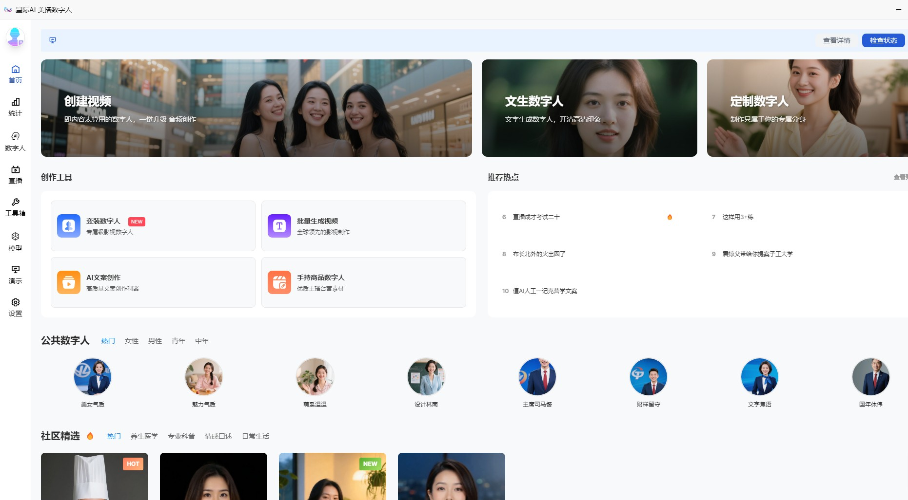
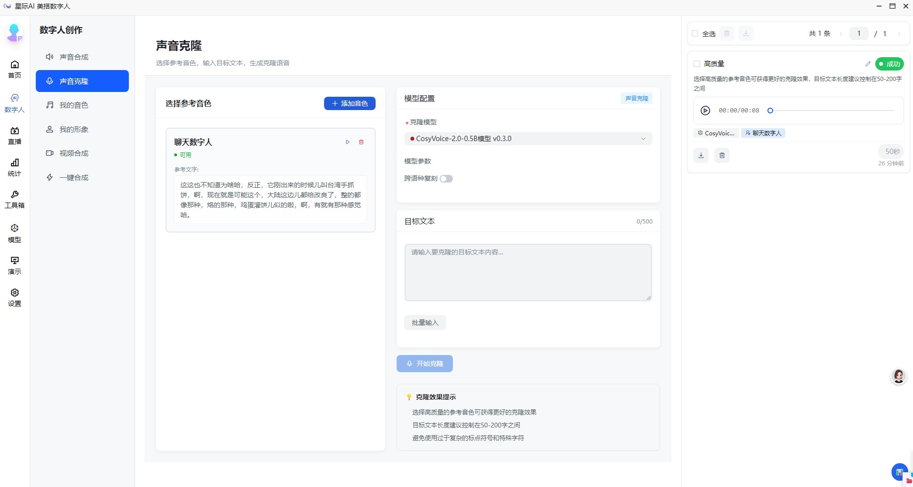
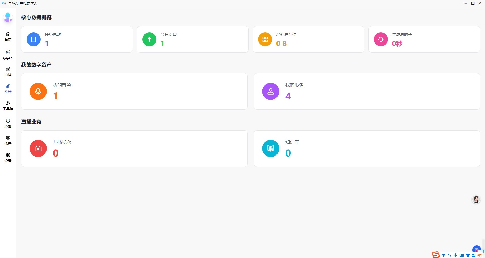
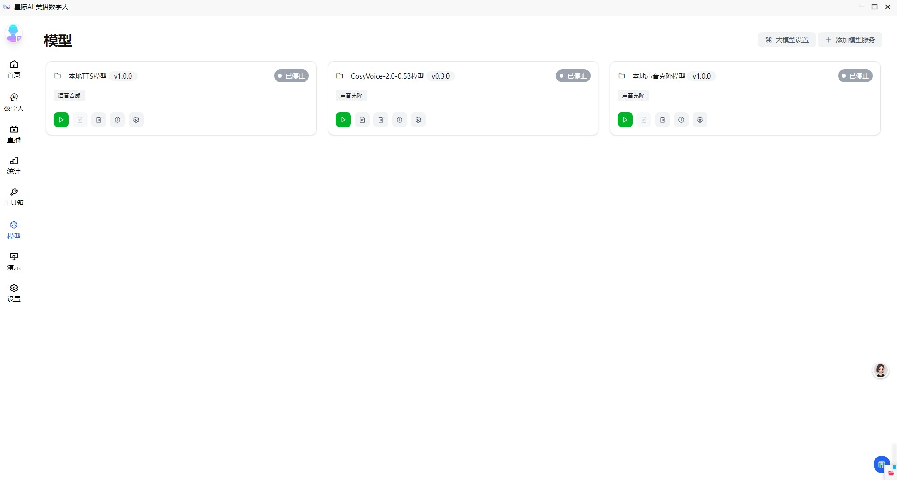
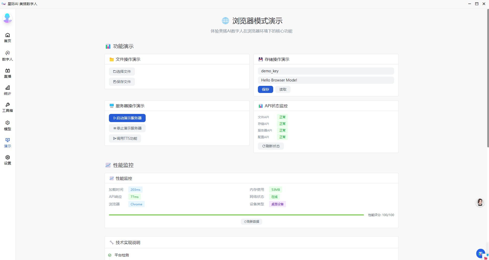

# 星际AI - 美搭数字人平台

[简体中文](./README.md) | [English](./README_en.md)

[](./LICENSE)
[](https://www.electronjs.org/)
[](https://vuejs.org/)
[](https://www.typescriptlang.org/)

**美搭AI数字人(xjaigc)** 是一款功能强大的AI数字人SaaS系统，支持私有化部署。它集成了业界领先的AI模型，为个人和企业用户提供一站式数字人解决方案。

我们的愿景是让每个人都能轻松拥有和使用自己的数字分身。

## ✨ 核心功能

### 🎤 AI声音合成
- **文字转语音（TTS）**：支持多种音色，实时合成自然流畅的语音
- **声音克隆**：基于5-30秒音频样本，克隆任意说话人声音
- **公共配音库**：精选默认音色一键选择，无需上传即可体验高质量配音
- **批量语音生成**：支持文本批量处理，提高生产效率

### 🎭 数字人生成
- **唇形同步视频**：AI驱动的精准唇形匹配技术
- **表情动画**：丰富的面部表情和动作库
- **高清输出**：支持4K分辨率视频生成

### 📺 直播功能
- **实时数字人直播**：AI数字人实时互动直播
- **语音驱动**：声音实时转换为数字人动作
- **多平台推流**：支持各大直播平台

### 🔐 用户系统
- **安全登录**：RSA加密+验证码双重验证
- **自动登录**：本地SQLite安全存储，支持自动登录
- **游客模式**：无需注册即可体验部分功能
- **数据同步**：云端用户数据与本地缓存智能同步

### 👤 个人中心（NEW!）
- **我的声音**：管理本地声音、自制声音等个人音色资源
- **我的形象**：管理本地形象、自制形象等数字人资源
- **我的模板**：管理已使用模板、收藏模板等个人模板库
- **我的素材**：管理上传的音频、视频、图片等创作素材
- **资源分类**：支持本地资源、服务端资源、自定义资源三种来源分类
- **统一管理**：集中展示个人资源使用情况，提升创作效率

### 🛠️ 模型管理
- **一键安装**：EasyServer框架，简化模型接入
- **热插拔**：模型服务动态启停，无需重启应用
- **资源监控**：实时GPU/CPU使用率监控
- **版本管理**：支持多版本模型并存

### 🎁 默认资源体系（NEW!）
- **开箱即用**：预置精选音色和数字人形象，新用户无需准备素材
- **官方推荐**：6个高质量音色（甜美小莉、专业安娜、温暖苏菲等）+ 6个专业形象（职场艾玛、教师丽莎等）
- **公共配音库**：弹窗式音色选择界面，支持性别/风格/语言筛选，一键试听选择
- **场景化模板**：5个常用模板（欢迎、产品介绍、教育、新闻、营销）
- **首次引导**：智能引导新用户快速体验核心功能，零门槛上手
- **资源管理**：统一的默认资源管理器，支持预览、试听、一键选择

### 📝 内容模板系统（NEW!）
- **专业模板库**：预置商务营销、教育培训、新闻播报等多场景模板
- **变量填写**：智能变量识别，用户只需填入关键信息即可生成完整脚本
- **公共模板**：官方精选模板，支持复制到个人库后自定义修改
- **个人模板**：用户自定义模板管理，支持保存、编辑、删除操作
- **历史记录**：变量值自动记录，常用内容快速填入，提升创作效率
- **模板中心**：统一的模板管理界面，支持分类浏览、搜索筛选、一键使用
- **视频创作**：专业级视频编辑器，基于CcClip成熟架构扩展xjaigc AI能力，支持拖拽编辑、时间轴管理、AI唇形合成
- **模板市场**：未来支持模板购买、分享、评价的完整生态

### 🎨 模板中心（Enhanced!）
- **现代化界面设计**：全新的模板浏览体验，美观直观的卡片式布局
- **智能分类筛选**：按商务营销、教育培训、新闻媒体等场景快速筛选
- **搜索和排序**：支持关键词搜索、按名称/分类/难度多维度排序
- **悬浮操作**：鼠标悬浮显示"查看"和"立即使用"按钮，交互体验流畅
- **详情弹窗**：完整的模板信息展示，包含变量说明、内容预览、使用指南
- **变量表单**：智能变量填写界面，支持文本/数字/选择/文件等多种类型
- **实时预览**：变量填写时实时预览生成内容，所见即所得
- **使用记录**：自动记录模板使用历史，便于后续查看和管理
- **分页加载**：支持大量模板的高性能展示，流畅的无限滚动体验

### 🎥 视频编辑器（NEW!）
- **专业级时间轴**：基于CcClip成熟架构的完整时间轴系统，支持多轨道编辑
- **7种轨道类型**：video/audio/text/image/effect/transition/filter全面支持
- **拖拽交互**：从左侧素材库直接拖拽到时间轴，自动计算时间位置和轨道分配
- **缩放控制**：20-200倍缩放范围，精确到帧的编辑精度，支持滑块+按钮控制
- **播放控制**：完整的播放/暂停、时间显示、进度控制功能
- **轨道管理**：智能轨道行管理，支持主轨道、重叠检测、自动分层
- **选中系统**：可视化选中状态，支持轨道项的选择、拖拽、调整大小
- **视觉优化**：完全符合xjaigc设计规范，浅色主题、标准色彩、流畅动画
- **AI集成**：与xjaigc AI服务无缝集成，支持声音合成、视频生成、唇形同步
- **性能优化**：虚拟滚动、事件防抖、内存管理，确保大项目流畅编辑

### 🎬 视频模板系统

### 竖屏高清支持
- **分辨率**: 720x1280 (9:16竖屏比例)，支持高清视频展示
- **网格布局**: 1行6列网格设计，支持水平滚动浏览
- **视频格式**: H.264编码MP4，AAC音频，30fps流畅播放

### 交互体验优化
- **悬停播放**: 鼠标悬停模板卡片自动播放视频预览
- **自动播放**: 点击"查看"详情时视频自动开始播放  
- **完整显示**: 详情页面视频100%展示内容，黑色背景专业效果
- **标签避让**: 智能调整各类标签位置，避免重叠遮挡

### UI布局修复
- **按钮位置**: 操作按钮悬停显示，不与文字重叠
- **标签定位**: 视频模板标签分层显示，分类标签右上角
- **预览区域**: 视频预览高度260px适配竖屏比例
- **信息展示**: 详情页右侧网格布局显示所有metadata字段

### 标准化元数据格式
```json
{
  "name": "开荒保洁",
  "title": "开荒保洁", 
  "category": "营销活动推广视频",
  "type": "video",
  "description": "专业的营销活动推广视频模板，适用于保洁格式，适合各类促销活动和品牌推广",
  "resolution": {"width": 720, "height": 1280},
  "files": {
    "video": "kaihuang.mp4",
    "thumbnail": "kaihuang.jpg"
  },
  "video": {
    "duration": 22,
    "frameRate": 30,
    "codec": "H.264"
  },
  "audio": {
    "codec": "AAC", 
    "sampleRate": 44100
  },
  "tags": ["营销", "保洁", "推广"]
}
```

### 创建新视频模板步骤
1. 在 `public/defaults/templates/` 下创建目录结构
2. 添加视频文件（推荐.mp4格式）和缩略图（.jpg/.png）
3. 创建 `metadata.json` 配置文件，包含基本信息
4. 系统自动扫描加载，支持热更新

### 真实资源加载
系统现已完全移除mock数据，直接加载`public/defaults/templates/`目录下的实际模板文件：

```
public/defaults/templates/
├── business/
│   └── marketing-campaign/
│       ├── metadata.json      # 模板配置文件
│       ├── kaihuang.mp4       # 实际视频文件 (13MB)
│       └── kaihuang.jpg       # 缩略图文件 (15KB)
└── [其他分类]/
    └── [模板名称]/
        ├── metadata.json
        ├── video.mp4
        └── thumbnail.jpg
```

### 标准化元数据格式
每个视频模板需要包含完整的metadata.json配置：

```json
{
  "id": "unique-template-id",
  "name": "模板名称", 
  "title": "显示标题",
  "category": "分类名称",
  "type": "video",
  "resolution": {
    "width": 720,
    "height": 1280,
    "aspectRatio": "9:16"
  },
  "tags": ["标签1", "标签2"],
  "price": 0,
  "difficulty": "beginner",
  "duration": 45,
  "author": "作者名",
  "version": "1.0.0",
  "description": "模板描述",
  "files": {
    "video": "video.mp4",      // 视频文件名
    "thumbnail": "thumb.jpg"   // 缩略图文件名
  },
  "metadata": {
    "fileSize": "12.5MB",
    "videoCodec": "H.264",
    "audioCodec": "AAC",
    "frameRate": 30,
    "bitrate": "2.5Mbps",
    "isHD": true
  },
  "created": "2025-01-29T00:00:00Z",
  "updated": "2025-01-29T00:00:00Z"
}
```

### 创建视频模板步骤
1. **准备资源文件**:
   - 视频文件: 720×1280分辨率，H.264编码
   - 缩略图: JPG格式，建议9:16比例

2. **创建目录结构**:
   ```bash
   mkdir -p public/defaults/templates/[分类]/[模板名]
   ```

3. **编写metadata.json**:
   - 参考标准格式配置模板基本信息
   - 设置正确的文件路径引用
   - 无需定义变量和时间轴

4. **放置文件**:
   ```
   [模板目录]/
   ├── metadata.json
   ├── [视频文件名].mp4
   └── [缩略图文件名].jpg
   ```

5. **验证加载**:
   - 重启应用自动扫描新模板
   - 在模板中心查看加载结果
   - 点击模板卡片预览视频内容

### 视频预览功能
- **模板卡片**: 显示缩略图和基本信息
- **详情弹窗**: 支持视频播放控制
- **分辨率标识**: 显示720×1280等规格信息
- **文件大小**: 自动显示视频文件大小

模板系统现已支持真实视频文件的加载、预览和使用，完全替代了之前的mock数据展示方式。

### 信息展示完整性
- **价格显示**: 详情页显示模板价格，免费模板显示绿色"免费"标签
- **标签展示**: 完整显示metadata.json中定义的所有标签
- **多数据源支持**: 同时支持template.tags和template.fullMetadata.tags
- **数据兼容**: 兼容price和fullMetadata.price两种数据结构

### 字段映射优化
- **模板基础信息**: name、title、category、description自动映射
- **技术规格**: 分辨率、帧率、编码等视频参数完整显示
- **元数据字段**: tags、price、author、version等扩展信息
- **文件路径**: 自动生成videoUrl和thumbnailUrl访问路径

## 🏗️ 技术架构

本应用采用前后端分离的现代化桌面应用架构，确保了高可维护性和扩展性。

- **桌面端框架**: Electron
- **前端技术栈**: Vue3 + TypeScript + Vite
- **UI 框架**: Arco Design Vue
- **状态管理**: Pinia
- **AI模型服务**: 通过子进程管理，支持内置TS服务和自定义Python服务
- **性能优化**: 虚拟滚动、数据缓存、组件懒加载、内存管理
- **进程管理**: 统一的进程生命周期管理、IPC通信优化、资源自动清理

## 🚀 快速开始

1.  **克隆项目**
    ```bash
    git clone https://github.com/ryonWang/xjaigc.git
    cd xjaigc
    ```

2.  **安装依赖**
    ```bash
    npm install
    ```

3.  **启动应用**
    ```bash
    npm run dev
    ```

## 🔧 性能优化特性

应用经过深度性能优化，确保在处理大量数据和高频操作时保持流畅：

### 阶段一：资源管理优化
- **音频/视频播放器优化**: 完整的资源清理机制，防止内存泄漏
- **事件监听器管理**: 防重复注册、安全移除、全面清理
- **组件生命周期**: 自动资源清理钩子，确保组件销毁时释放所有资源
- **内存监控**: 实时内存使用监控，自动垃圾回收触发

### 阶段二：渲染性能优化
- **虚拟滚动**: 大列表自动启用虚拟滚动，支持>50项数据的高性能渲染
- **数据缓存**: LRU缓存管理器，智能缓存API响应和计算结果
- **组件懒加载**: 基于Intersection Observer的可见性检测懒加载
- **渲染优化**: 批量DOM更新、防抖节流、RAF优化

### 阶段三：进程管理优化
- **进程生命周期管理**: 统一的子进程创建、监控、清理机制
- **IPC通信优化**: 批量消息处理、请求队列、超时控制
- **窗口管理**: 智能窗口状态持久化、崩溃恢复、资源清理
- **开发工具优化**: 稳定的DevTools管理，防止开发时崩溃


## 📡 API接口状态

### 后端对接完成 ✅
- ✅ **用户认证**: 支持用户登录、游客登录、用户信息获取
- ✅ **验证码系统**: 点击文字验证码验证完整流程  
- ✅ **密码加密**: RSA公钥加密密码传输，确保安全性
- ✅ **错误处理**: 统一错误处理机制，友好的中文提示
- ✅ **用户存储**: SQLite本地安全存储用户信息、会话和偏好
- 🌐 **后端服务**: http://localhost:7100

### 🗄️ SQLite用户存储架构

#### 数据库设计
- **用户信息表(user_info)**: 存储用户基本信息(用户名、邮箱、头像、性别等)
- **用户会话表(user_session)**: 存储AES加密token和登录状态，支持7天自动登录
- **用户偏好表(user_preferences)**: 存储用户个性化设置(主题、语言、自动登录开关等)

#### 业务流程
- **登录成功**: 自动保存用户信息+加密会话+偏好设置到SQLite
- **应用启动**: 检查SQLite有效会话，支持无感知自动登录
- **退出登录**: 清除SQLite会话信息，确保安全性
- **网络异常**: 使用SQLite缓存维持基础功能

#### 安全特性
- **AES加密**: 使用crypto-js对token进行AES对称加密存储
- **过期管理**: 7天token过期机制，自动清理过期会话
- **索引优化**: 为用户ID建立索引，提升查询性能
- **错误处理**: 完整的异常处理和降级方案

#### 技术集成
- **后端**: UserDatabase类完整CRUD + 11个IPC接口
- **前端**: 集成到Vuex用户Store的Login/Logout/CheckAutoLogin
- **存储**: 文件级持久化，关闭应用后数据不丢失


## 🤝 贡献

我们欢迎所有形式的贡献！无论是提交Bug、建议新功能还是贡献代码，都对项目至关重要。

## 🗓️ 开发计划 (Roadmap)

我们正在规划以下新功能，以不断增强产品能力：

- [👉] **B/S端资源打通**: 实现与服务端公共资源库的对接，包括视频、模型模板等。
- [👉] **直播功能**: 集成直播推流能力，支持数字人实时直播。
- [👉] **话术与语料库**: 内置和支持自定义话术、语料模板，提升内容创作效率。
- [👉] **场景装修**: 为短视频和直播提供背景板、贴图、道具等素材，丰富视觉效果。
- [👉] **教育版数字人**: 探索面向教育领域的独立版本，提供数字人课程、PPT制作系统。

## 📸 应用截图









## 许可

[Apache-2.0](./LICENSE) License.

Copyright © 2023-2025 [xjaigc](https://github.com/ryonWang/xjaigc)

## 📖 使用说明

### 🔐 用户登录使用指南

#### 1. 注册和登录
1. **首次使用**：点击右上角头像 → 选择"注册账号"
2. **已有账号**：点击右上角头像 → 输入用户名密码 → 输入验证码 → 登录
3. **游客模式**：点击"游客登录"可免注册体验基础功能

#### 2. 智能自动登录
- **自动登录**：用户正常关闭应用后，下次启动自动恢复登录状态
- **手动退出**：用户主动点击"退出登录"后，下次启动不会自动登录，需要手动重新登录
- **数据安全**：所有会话信息加密存储在本地SQLite数据库，采用AES-256加密
- **过期管理**：Token有效期30天，过期后自动清理

#### 3. 用户中心功能
- **个人资料**：查看和编辑用户基本信息，包括头像、用户名、邮箱等
- **VIP服务**：查看VIP特权说明，升级VIP账户享受更多服务
- **使用统计**：实时显示生成任务数、使用时长、成功率等数据
- **个人设置**：自定义界面主题、语言、通知设置等个人偏好

#### 3.1 用户中心访问方式
- **登录后点击头像**：直接跳转到本地用户中心页面
- **侧边导航设计**：采用与数字人、工具箱相同的左侧导航布局
- **多标签切换**：个人资料、VIP服务、使用统计、个人设置四个功能模块
- **响应式设计**：支持不同屏幕尺寸，保持良好的用户体验

#### 4. 权限说明
- **游客用户**：可使用基础TTS功能
- **注册用户**：享受完整功能，包括声音克隆、视频生成
- **VIP用户**：无限制使用，优先处理，高级模型

#### 5. 数据安全
- 用户密码使用RSA 2048位加密传输
- 本地token采用AES加密存储
- 支持一键清除所有本地认证数据

### 🎵 语音合成使用指南

#### 🎤 公共配音库使用方法
1. **进入音色管理**：点击侧边栏"我的音色"进入音色列表页面
2. **打开公共配音**：点击页面右上角"公共配音"按钮打开音色选择弹窗
3. **筛选音色**：支持按性别(男/女)、风格、语言等条件筛选音色
4. **试听音色**：点击音色卡片上的"试听"按钮预览音色效果
5. **选择音色**：点击"选择"按钮将公共音色添加到您的音色库
6. **使用音色**：在声音合成或声音克隆页面选择添加的音色即可使用

#### 🔊 声音克隆中的音色管理
1. **进入克隆页面**：点击侧边栏"声音克隆"进入声音克隆功能
2. **音色资源区域**：在左侧音色选择区域找到"🎵 音色资源"功能区
3. **公共配音使用**：
   - 点击"公共配音"按钮打开公共音色库弹窗
   - 筛选并试听合适的音色
   - 点击"选择"将音色添加到个人音色库
   - 选择后自动应用于当前克隆任务
4. **添加声音功能**：
   - 点击"添加声音"按钮打开音色添加弹窗
   - 输入音色名称和参考文字
   - 上传5-30秒的高质量音频文件
   - 保存后立即可用于声音克隆
5. **使用建议**：公共音色经过专业优化，克隆效果更佳，推荐优先使用