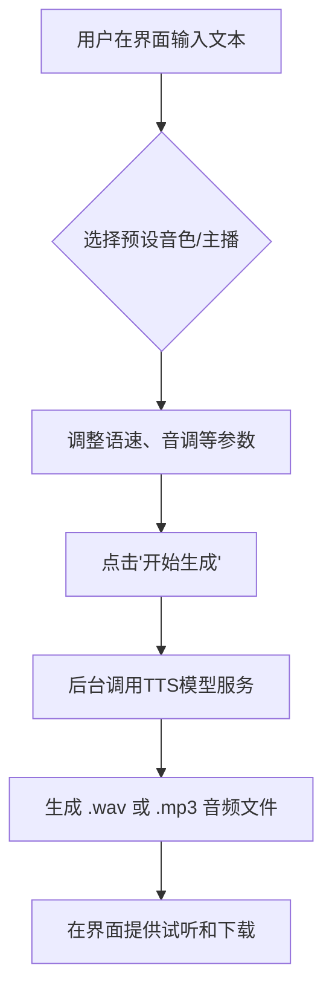
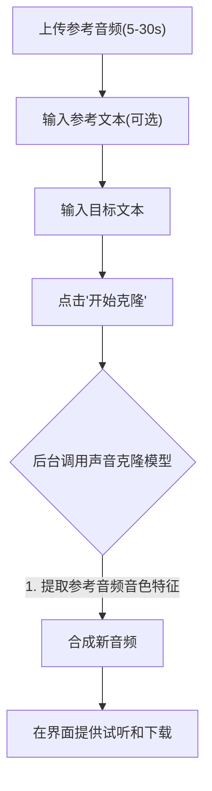
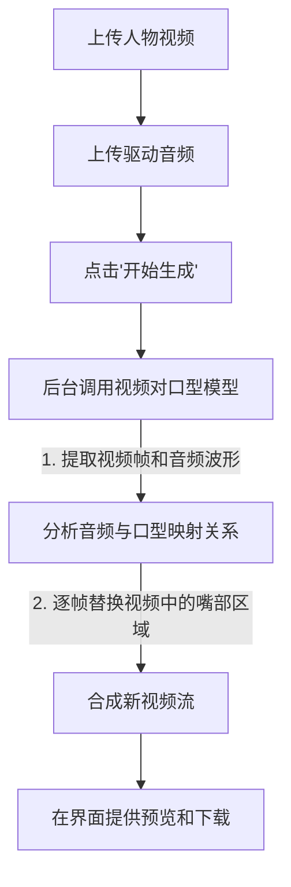

# 美搭AI数字人 - 产品说明文档

欢迎使用 **美搭AI数字人(xjaigc)**！本产品是一款集成了多种前沿AI能力的数字人工具，旨在为您提供高效、便捷的语音和视频内容创作体验。

## 核心功能概览

- **文本转语音 (TTS)**: 将任意文本转化为自然流畅的语音。
- **声音克隆 (Voice Clone)**: 用您或他人的声音来说任何话。
- **视频对口型 (Video Lip-Sync)**: 让静态或动态的人物视频根据您的音频开口说话。

---

## 功能使用指南

### 1. 文本转语音 (TTS)

此功能可以将您输入的文字，通过AI模型合成为语音文件。

**操作流程:**

1.  在主界面选择"文本转语音"功能。
2.  在文本框中输入您想要转换的文字。
3.  从"音色列表"中选择一个喜欢的声音。
4.  （可选）调整语速、音调等高级参数。
5.  点击"开始生成"，稍等片刻即可在结果区域试听和下载音频文件。

**业务流程图:**

### 2. 声音克隆

此功能可以学习一段参考音频的音色，然后用这个音色来朗读新的文本。

**操作流程:**

1.  在主界面选择"声音克隆"功能。
2.  点击"上传参考音频"，选择一个时长在5-30秒的清晰人声`.wav`或`.mp3`文件。
3.  （可选，但推荐）如果参考音频有对应的文本，请在"参考文本"框中输入，这能提高克隆的相似度。
4.  在"目标文本"框中，输入您想让克隆声音朗读的文字。
5.  点击"开始克隆"，生成结果会出现在下方。

**业务流程图:**

### 3. 视频对口型

此功能可以让您上传的一段人物视频，根据您提供的音频，生成精准的口型同步效果。

**操作流程:**

1.  在主界面选择"视频对口型"功能。
2.  点击"上传视频"，选择一段包含清晰人脸的视频文件。
3.  点击"上传音频"，选择您想让视频人物朗读的音频文件。
4.  点击"开始生成"，系统将自动处理视频和音频，并生成最终结果。

**业务流程图:**

---

## 模型管理

本产品具有强大的模型管理能力，支持热插拔和自定义模型接入。

- **自动发现**: 应用启动时会自动扫描本地的模型目录，加载所有符合规范的模型。
- **添加模型**: 您可以通过"模型管理" -> "添加本地模型"来导入新的模型。
- **EasyServer自定义模型**: 如果您是开发者，可以遵循 `EasyServer` 规范，通过简单的 `config.json` 和 `run.py` 脚本，将您自己的AI模型集成到本产品中，实现功能的无限扩展。 